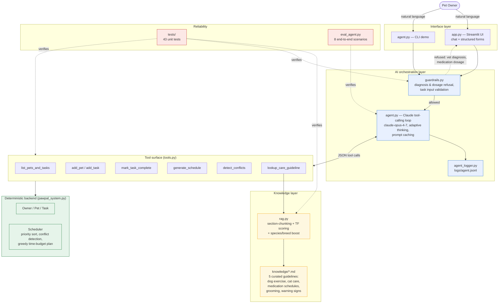

# PawPal+ Applied AI Architecture

## System diagram

## Data flow (typical chat turn)

1. User sends message via Streamlit chat or CLI.
2. `guardrails.check_user_input` scans for diagnosis/dosage requests; if matched, returns a refusal *without* calling the API.
3. Agent loop sends `(system prompt + tool defs + conversation history + user message)` to Claude Opus 4.7 with adaptive thinking. System prompt and tool definitions are cached (`cache_control: ephemeral`) so follow-up turns pay only ~10% of input cost.
4. Claude responds with either text (end of turn) or one or more `tool_use` blocks.
5. For each tool call: `tools.dispatch` runs the corresponding handler against the live `Owner` object or the RAG retriever. Tool input is validated against the same guardrails the structured forms use.
6. Tool results are appended to the message history; the loop continues until Claude emits no more tool calls (capped at 8 iterations as a safety net).
7. Every step (thinking, tool call, tool result, final text, confidence score) is appended to `logs/agent.jsonl` and exposed in the Streamlit "Reasoning trace" expander.

## Why these choices

- **Manual agentic loop** (vs. SDK tool runner): we need per-step observability for the reasoning-trace UI and the eval harness. The runner abstracts that away.
- **Manual RAG** (vs. embeddings + vector DB): the knowledge base is small (5 docs, ~20 chunks) and queries map well to keyword + heading matches. A 50-line scorer is easier to test, explain, and ship than a vector store.
- **Tools wrap existing methods rather than replacing them**: the deterministic scheduler stays the source of truth for what gets scheduled. The agent only orchestrates — it cannot bypass the time budget, the priority sort, or the conflict detector.
- **Two-layer testing**: 43 unit tests cover deterministic pieces (RAG retrieval, tool wrappers, guardrail patterns); the live eval harness (`eval_agent.py`) covers agent behavior. Splitting them keeps the unit suite fast and offline while still measuring end-to-end reliability.
